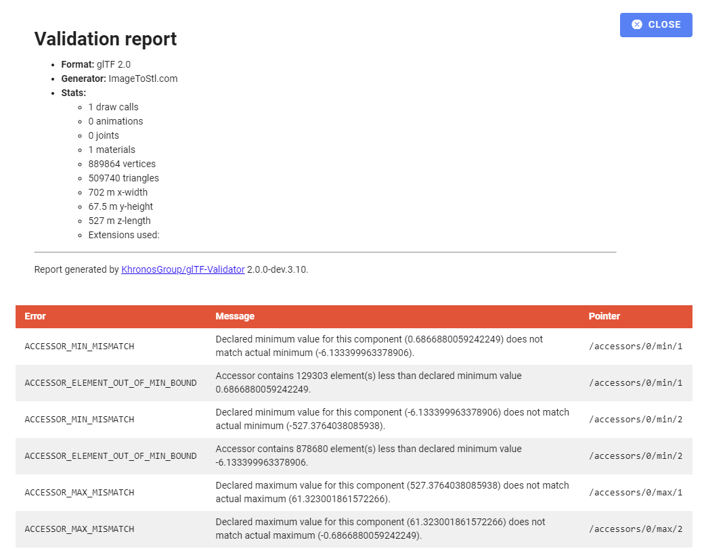

This is my first attempt at applying laser microscopy to acquire 3d point clouds of integrated circuits and displaying them here.





## Chips

### Phillips BDX 

<!--  -->

### Intel

<!--  -->

## Data Conversion

INSERT MERMAID DIAGARM HERE!

The data is acquired on a Keyence microscope and packaged in their proprietary e.g. `.vk6`/`.vk4` file format. The Keyence multifile analyzer software is used to export the microscopy data files to ``.stl`` or ``.step``.

Note Gwyddion can also open `.vk6`/`.vk4` files, but I wasn't able to export a valid stl file with it. The Keyence software simply works and is very easy to use.
I have noticed that stl provides better performance, while FreeCAD failed to open data saved as stp files.
While I managed to export printable ``.3mf`` files even without increasing the scaling on the exported data. I had trouble converting it into ``.glb`` file that the model-viewer can take. 

And more importantly, it is not displayed at all on my embedded model-viewer here.

Note: FreeCAD can open microscopy data (but not .vk4 or .vk6 files) and export to glb (which has not worked so far, even when scaling up beforehand.)

- [FreeCAD wiki on GITF](https://wiki.freecad.org/GlTF)
- [Converter where you can also share files via link](https://www.3dpea.com/en/convert/STL-to-GLB-compressed-with-DRACO)
	- This service worked. But the file size is limited to 500 Mb.
- I managed to get a file displayed in model-viewer/editor/ after scaling all units by 1000 times and converting the stl to glb on this website, [imagetostl.com](https://imagetostl.com/convert/file/stl/to/glb#convert).
Unfortunately even though the model is displayed in the editor, this error message is generated: 
- Windows 3d-Viewer can save as ``.glb``

To change the appearance of the model e.g. its texture the [modelviewer.dev/editor](https://modelviewer.dev/editor/) can be used to change it and safe it in the ``.glb`` file, which is different to the Windows 3d-Viewer which safes it as an external ``.json`` file.

## Ideas

- Add optical image as a texture 
	- Better as normal map:
	 
- Add an animated texture to highlight certain parts of the ic
- Add dimensions
