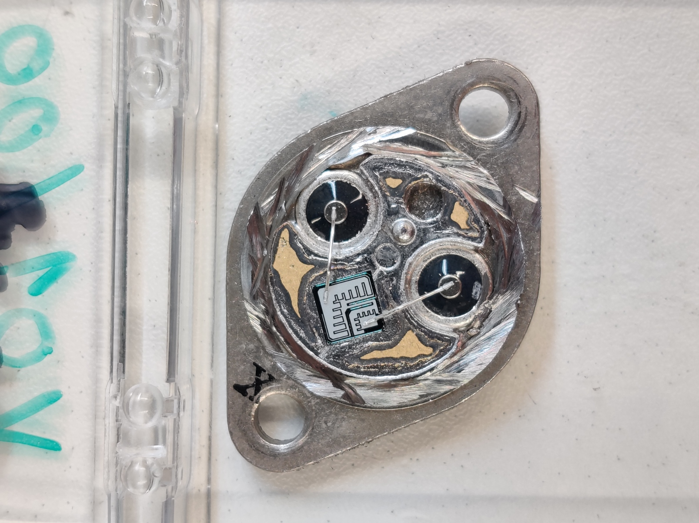
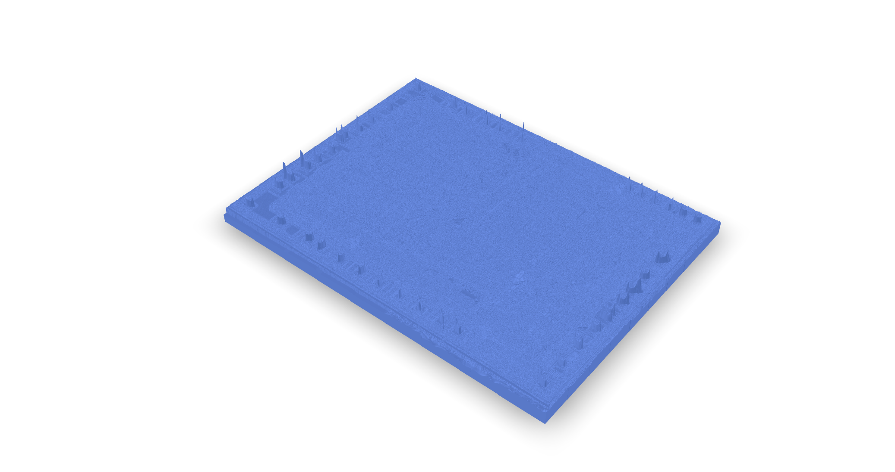
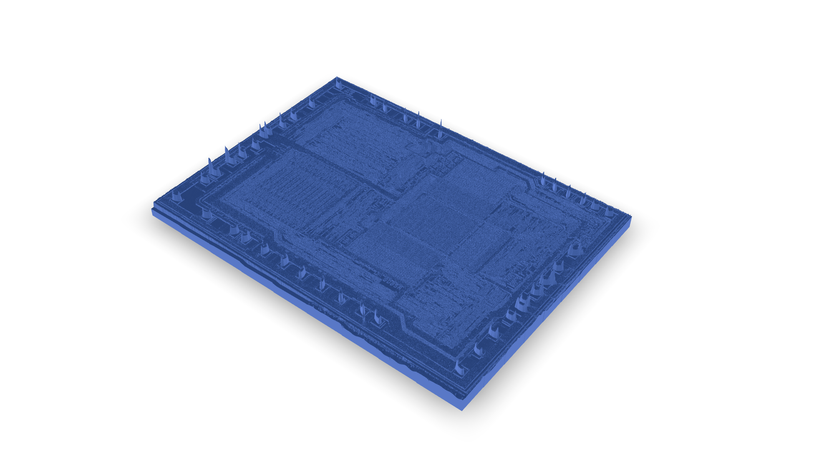

This is my first attempt at applying laser microscopy to acquire 3d point clouds of integrated circuits and displaying them here.





## Chips

### Phillips BDX 


<!--  -->

### Intel



## Data Conversion

The data is acquired on a Keyence microscope and packaged in their proprietary e.g. `.vk6`/`.vk4` file format. The Keyence multifile analyzer software is used to export the microscopy data files to ``.stl`` or ``.step``.

Note: Gwyddion can also open `.vk6`/`.vk4` files, but I wasn't able to export a valid stl file with it. The Keyence software simply works and is very easy to use.


FreeCAD can open some microscopy data formats(but not .vk4 or .vk6 files). It also officially supports exports to ``.glb`` (see [FreeCAD wiki on GITF](https://wiki.freecad.org/GlTF)) but the mesh export function does not support it. I have noticed that stl provides better performance, while FreeCAD failed to open data saved as stp files.
On a side note: it can export printable ``.3mf`` files even without increasing the scaling on the exported data, which then have to be scaled in the slicer e.g. Cura, Meshmixer, ... 

### Online Converters 

There are many online converts with varying robustness and file size support. While they can be easily reached with a simple web search I see no reason why I should trust them with my data when Windows 3D-Viewer can do the same for free with virtually unlimited file size support and also faster and more reliable. Nether the less here are some I have tried before switching over.

- [Converter where you can also share files via link](https://www.3dpea.com/en/convert/STL-to-GLB-compressed-with-DRACO)
	- This service worked. But the file size is limited to 500 Mb.
- I managed to get a file displayed in model-viewer/editor/ after scaling all units by 1000 times and converting the stl to glb on this website, [imagetostl.com](https://imagetostl.com/convert/file/stl/to/glb#convert).
Unfortunately even though the model is displayed in the editor, this error message is generated:
    ```
    Error
    Message
    Pointer
    ACCESSOR_MIN_MISMATCH
    Declared minimum value for this component (0.6866880059242249) does not match actual minimum (-6.133399963378906).
    /accessors/0/min/1
    ACCESSOR_ELEMENT_OUT_OF_MIN_BOUND
    Accessor contains 129303 element(s) less than declared minimum value 0.6866880059242249.
    /accessors/0/min/1
    ACCESSOR_MIN_MISMATCH
    Declared minimum value for this component (-6.133399963378906) does not match actual minimum (-527.3764038085938).
    /accessors/0/min/2
    ACCESSOR_ELEMENT_OUT_OF_MIN_BOUND
    Accessor contains 878680 element(s) less than declared minimum value -6.133399963378906.
    /accessors/0/min/2
    ACCESSOR_MAX_MISMATCH
    Declared maximum value for this component (527.3764038085938) does not match actual maximum (61.323001861572266).
    /accessors/0/max/1
    ACCESSOR_MAX_MISMATCH
    Declared maximum value for this component (61.323001861572266) does not match actual maximum (-0.6866880059242249).
    /accessors/0/max/2
    ```

## Editing Models/Meshes

FreeCAD has a powerful [Mesh Decimating](https://wiki.freecad.org/Mesh_Decimating) function which can be used to minimize a models file size by reducing the number of faces. This will inadvertently alter the model and in many cases rip holes into it, which gets worse the stronger the mesh is decimated. These holes can then be repaired in Meshmixer manually or automatically which may further distort the model.


- Windows 3d-Viewer can save as ``.glb``

To change the appearance of the model e.g. its texture the [modelviewer.dev/editor](https://modelviewer.dev/editor/) can be used to change it and safe it in the ``.glb`` file, which is different to the Windows 3d-Viewer which safes it as an external ``.json`` file.

## Ideas

Adding the optical image as a normal map to the glb file greatly enhances visibility of small features:

<div class="flex flex-col md:flex-row gap-4 justify-center items-start my-4">
  <figure class="w-full md:w-1/2">
    
    <figcaption class="text-center text-sm mt-2">Without normal map</figcaption>
  </figure>
  <figure class="w-full md:w-1/2">
    
    <figcaption class="text-center text-sm mt-2">With normal map</figcaption>
  </figure>
</div>

- Add an animated texture to highlight certain parts of the ic
- Add dimensions
