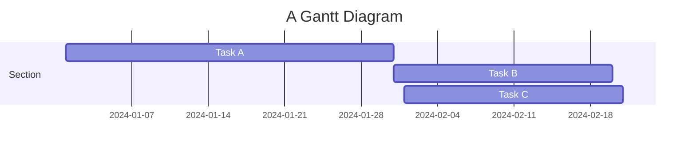

## Diagrams

## Sources

- Mermaid Documentation
  - [Gantt](https://mermaid.js.org/syntax/gantt.html)
  - [Timeline](https://mermaid.js.org/syntax/timeline.html)
- [Blog post](https://www.dbbrunson.com/docs/effective-online-presence/markdown-extensions-capabilities/embedding-mind-maps-mermaid/)