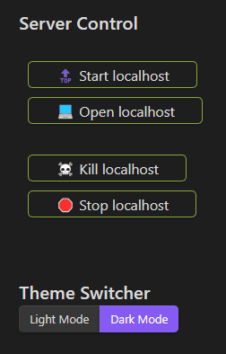
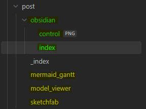

This post was created, edited and pushed from Obsidian. 
Some community plugins go a long way to transform Obsidian into a comfortable and easily accessible editor.
This is an effective and free alternative to Obsidian publish.

Using Shell-commands and buttons a note can be transformed into a control centre from which the local server can be launched, the generated site accessed and also be stopped from again. 

While Hugo Blox prominently advertises this feature, to my knowledge there is no reason that the same could be done for a site generated with Jekyll for example or any other static site generator as long as it supports deployment to GitHub pages via an action.

## Essential Obsidian Plugins

- git - to push and deploy from within obsidian
- file-hider - to declutter the navigation view from files that can't be effectively edited in Obsidian)
- shell-commands - to control the localhost
- buttons - to quickly add templates, start server, ...
- meta-bind - same as "buttons" but nicer looking, limited by yaml markup
- templater - to streamline the creation of new posts
- linter - could maybe be used to replace incompatible Markdown formatting

## Posts

The `.md` files for posts can either be placed in the `post` folder directly or inside a folder with the same name and the source file, named `index.md`. The latter enables the placement of images for the post directly inside the folder as seen in the example below.

