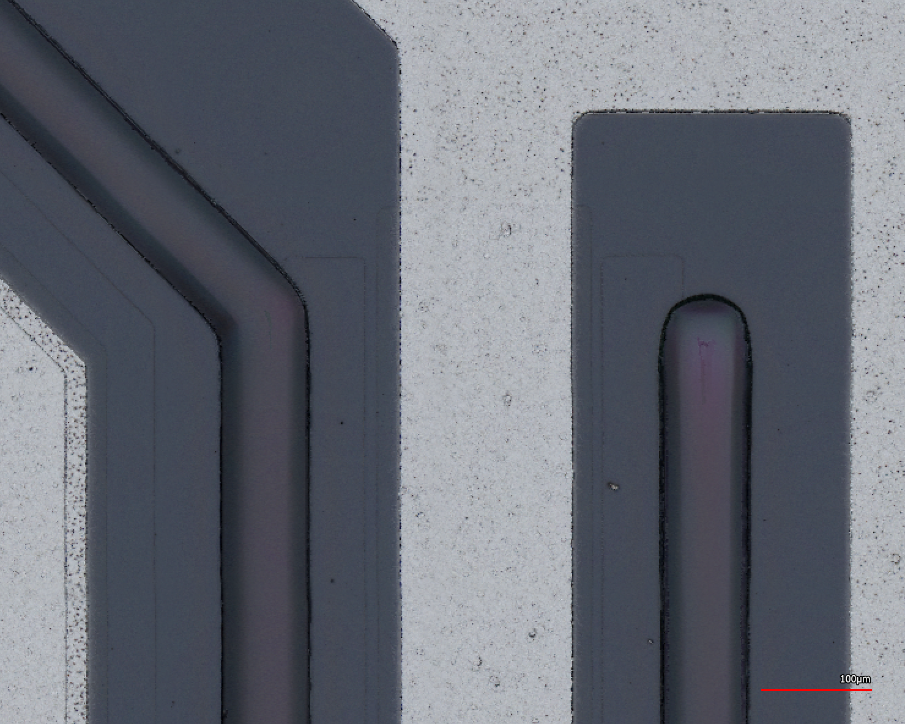

## Optical Images



  <figure>
    
    <figcaption>Close up 1</figcaption>
  </figure>
  <figure>
    
    <figcaption>Close up 2</figcaption>
  </figure>

## Datasheet

<a href="SEMELAB_BDX67B_datasheet.pdf">SEMELAB BDX67B</a>