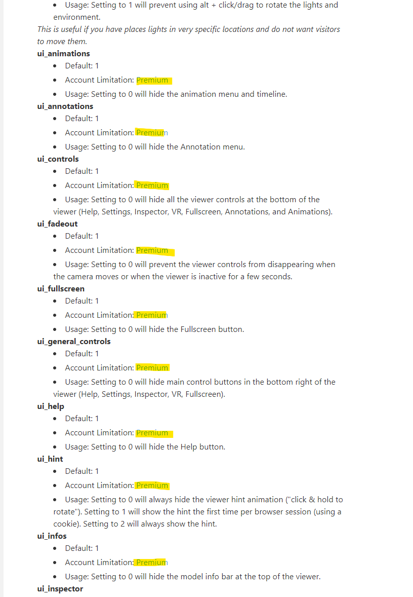
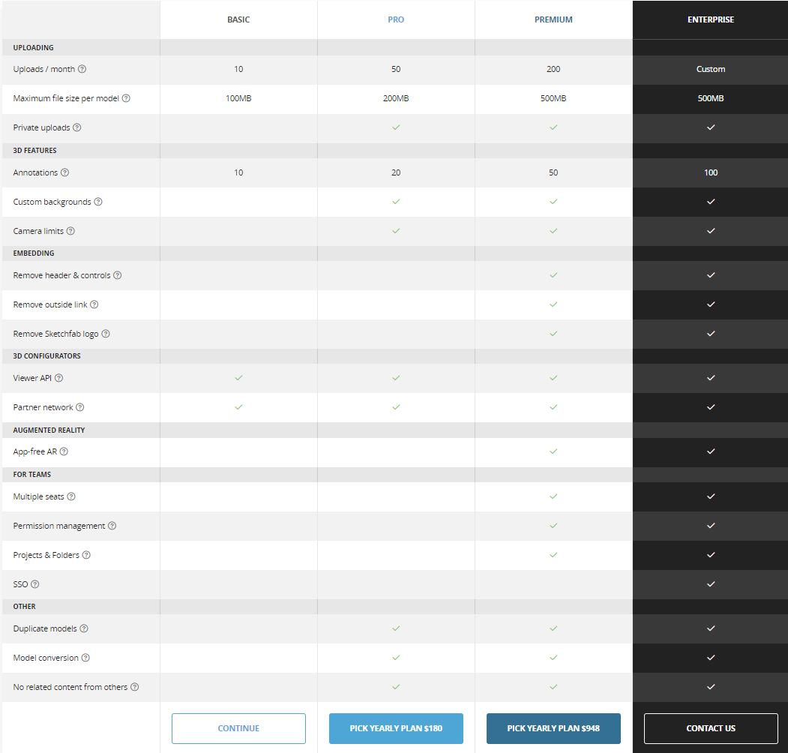

This is a test of two methods for embedding the sketchfab-viewer, Sketchfab's 3d model viewer API.
This site is not affiliated with Sketchfab in any way.

The first method relies on a post made [here](https://www.dbbrunson.com/docs/effective-online-presence/markdown-extensions-capabilities/embedding-3d-models/).

<!-- Article: https://www.dbbrunson.com/docs/effective-online-presence/markdown-extensions-capabilities/embedding-3d-models/ -->



The second version is an example from Sketchfab's own website, [here](https://sketchfab.com/developers/viewer).


<!--This is Hugos shortcode syntax to embed content -->

## Features

Their service seems to be aimed primarily at media/content creators.
At least they do **not support** the common `.step` and `.iges` file formats.

Supported file formats: 
`.fbx` `.obj` `.dae` `.blend` `.stl`

Private uploads are not allowed unless you pay.

Considering the [initialization & options documentation](https://sketchfab.com/developers/viewer/initialization) it also looks like that a lot of interesting settings are locked behind a paywall, like disabling the Ui controls.

They make this very clear on there license options page.

They have a [GitHub organization](https://github.com/sketchfab) where they host a lot of plugins for popular cad software.

