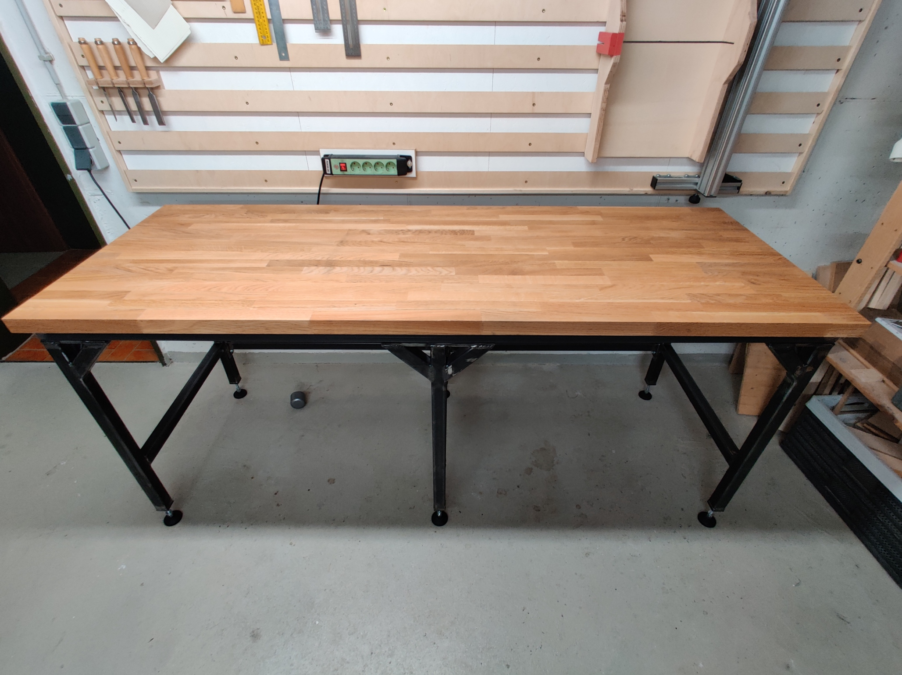
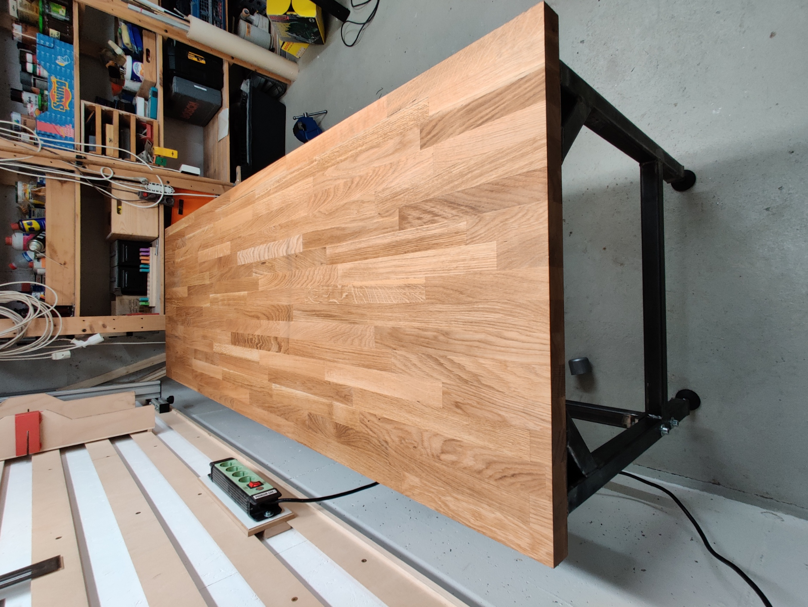
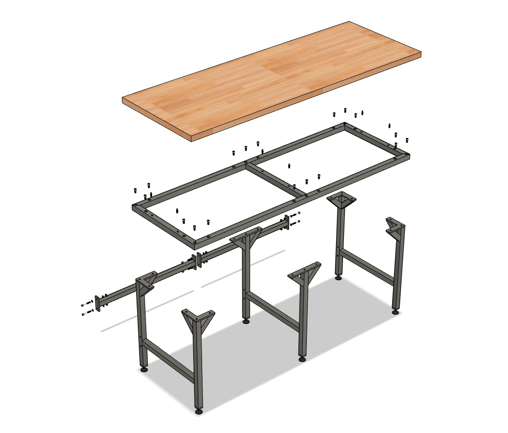

For every kind of work, there exists a table. Any kind of work can be performed on any kind of table, but the work is tremendously more fun when it’s on the right table.

For a workbench, the requirements are particularly high. The tabletop should be able to withstand the abuse of pounding and scratching and the underbody should stay firmly in place when doing so. Shearing the feet of the table is especially hindering when trying to work precisely because it leads to the work surface rocking from side to side. Stable construction and a heavy work surface are needed. Unfortunately, this makes it hard to move the bench, let alone get it into its predestined space if that space is somewhere in the basement. So the decision was made to go for a modular construction so that the individual pieces can be assembled on the spot.

## Planning
### Tabletop

The most economic option would have been to use an off-the-shelf kitchen top from the hardware store. But here in Germany, these are about 60 cm deep which is not enough for my needs. So I settled on a solid 40 mm thick 2000 x 720 mm oak worktop. Over time the tabletop can expand and shrink orthogonal to the wood grain. When working with solid wood (e.g. not MDF or multiplex) it’s important to allow for this wood movement. Here this is done by seating the screws that hold onto the wood into slits that are cut into the steel frame. These slits have to be orthogonal to the wood grain.

### Feet

To compensate for an uneven floor the legs feature extendable machine feet. To the bottom of each foot, a 10 mm thick plate is welded which is drilled and tapped with an M10 thread.

## CAD

It took me three tries in Fusion360 to come up with the design you see below.

Editing the model is encouraged and easy to do since the design is parametric.
To do so you will need Fusion 360 and open the f3z archive file where you will find the change parameters pane. Feel free to visit <a href='https://grabcad.com/library/workbench-plans-included-2'>my GrabCAD page</a> where I have uploaded the step and f3z files.

### Drawings

Unfortunately, I only have German drawings, since I build this project in the summer of 2021 before I even had the plan to document my workings on an English website. However, I am pleased to announce that you can use these plans for free and do whatever you want with them. But if you choose the build my table I would appreciate it if you could let me know.

## Manufacturing

The problem with building your first workbench is having no workbench to build the workbench on. So you might choose to sit on the ground and lean over the workpiece but if you want your finished table to be flat and not follow the form of your crooked concrete garage floor you will have to get a bit more clever. A proposed solution would be to offset the workpiece from the ground on exactly three places, ideally using spheres, thus defining a new plane. But with only three points of contact work holding becomes quite challenging without specialist equipment since you can’t just clamp it down to a known flat surface. Fortunately for me, I found a solid metal body from an old laboratory table at my university. So I used that one as my welding table.

## Cost breakdown

| Item        | Prize       |
| ----------- | ----------- |
| steel       | 212,00€     |
| worktop     | 249,00€     |
| **total**   | **461,00€** |
	
In addition, there were expanses for welding rods (~20€) and fasteners.

## Conclusion

For the first welding project, the welds turned out better than expected. It took much more time than I expected because given my limited amount of work-holding options and experience I constantly had to move the workpieces around and clamp them in an optimal position for me to weld.
In the end, the whole project took the better part of the summer but resulted in a satisfactory worktable. The table is clearly missing drawers and the angled beams in the corner could be left out in the front to make room for some.